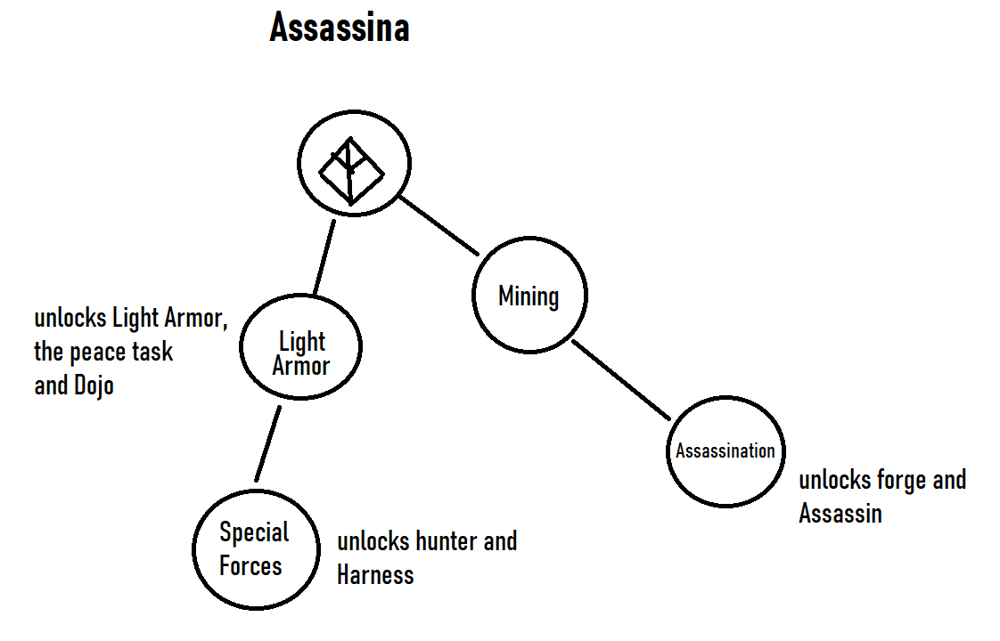
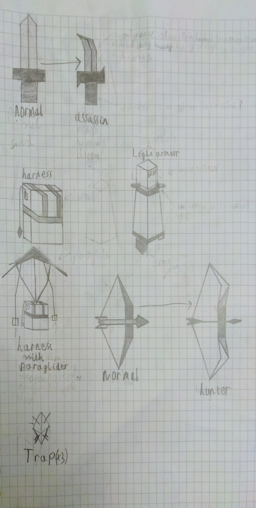
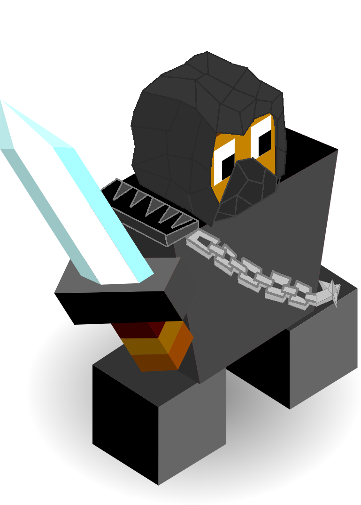
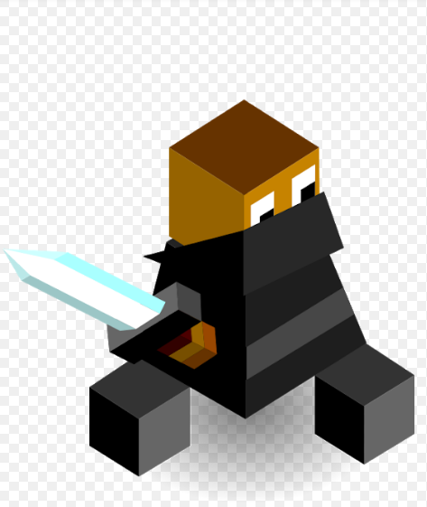

# Assassina

*Isolated among the mountains with nothing but their wits and the weapons gifted by Vengir the Assassina learnt to fight like no others. Armed with Knifes and blades they are willing to risk it all to claim their spot on the throne.*

---

The Assassina start the game with the Assassination tech which allows them to make sneaky attacks.

## Techs

Assassination replaces Smithery
 - allows the construction of forges and the training of Assassins.

Light Armor replaces meditation
 - allows the construction of Dojos, unlocks light armor and starts the peace task.

Special Forces replaces philosophy
 - allows the training of Hunters, unlocks harness and adds the literacy bonus.

## Units

| name | cost | health | attack | defence | range | movement | skills |
|:-----|:----:|:------:|:------:|:-------:|:-----:|:--------:|:-------|
| Assassin | 5 | 15 | 3 | 1 | 2 | 1 | Dash, Hide, Fortify |
| Hunter | 5 | 15 | 2 | 2 | 1 | 1 | Dash, Trap, Fortify |
| Superior Assassin | N/A (super unit) | 30 | 4 | 2 | 2-3 | 1 | Dash, Chain, Hide |

## Skills

Hide
- gives a bonus when in a forest
- an increase of 1 attack and 1 movement
- excludes Super Units and any special unit with light armor buff

Trap
- can lay down a total of 3 traps
- they last until an enemy unit steps on them
- doing so will remove the trap and deal 2 attack damage (enemies can see the trap)

Chain
- can attack a unit within 2 tiles of them
- it can then go on to hit another target within 1 tile
- units hit by this chain will take damage and then become stuck until the attacking unit releases them
- while the enemy is trapped the attacking unit will also be imobilised
- the first target hit by the chain will recieve full damage then next target only revieves 1 half of that.

Glide
- can only be used for units standing on a mountain tile
- useful for a unit escaping heavy fire
- when standing on a mountain, a boost of 2 movement in any direction
- units must end on a ground tile and not water
- once the unit has landed back on the ground it will lose the 3 movement

## Buildings

Dojo
- can be constructed for 5 stars with a max of 1 per city
- any special units of the Assassina standing on the Dojo may choose an infinte buff for a small price
- buffs:
   - light armor
     - provides an additional defence point
     - an extra 5 health for the price of 3 stars
     - units with light armor may not become veterans nor will they be able to change back
     - this buff can not be applied to super units
   - harness
     - provides the unit with the glide skill for the price of 3 stars
     - this buff may not be removed and can be applied to super units.

## Images

*Expanded Climbing Branch*

*Super Unit (Supreme Assassin)*

*of course this is the assassin normal unit (by Midjiwan)*
