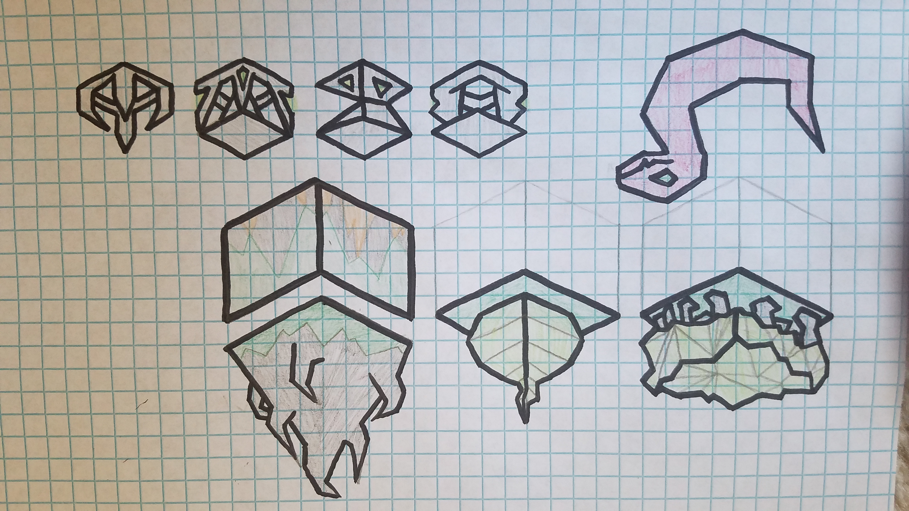

# Azanah

---

## Techs

Philosophy -> Maddening 
Free Spirit -> Sacrafice  

## Abilities

Madden makes a unit attack those around it  
It is no longer controlled by any tribe and it’s only goal is to do as much damage as possible  
AI works like Nature Bunny  

Disband -> Sacrifice  
Sacrifice can only be done at an altar which costs 10 to build and each sacrifice gives 1 population, and 100p costing 2 stars per  
 
Convert -> Madden 

## Buildings 

Temple -> Altar  

## Units 

| replaces | name | cost | health | attack | defence | range | movement | skills |
|:---------|:-----|:----:|:------:|:------:|:-------:|:-----:|:----:|:-------|
| Mind Bender | Cult Leader | 5 | 10 | 0 | 1 | 1 | 1 | Madden |
| Swordsman | Cult Assassin | 5 | 15 | 3 | 2 | 1 | 1 | Dash, Escape, Fortify |
| Giant | Accursed One | N/A | 20 | 2 | 3 | 2 | 2 | Dash, Fly, Madden |

