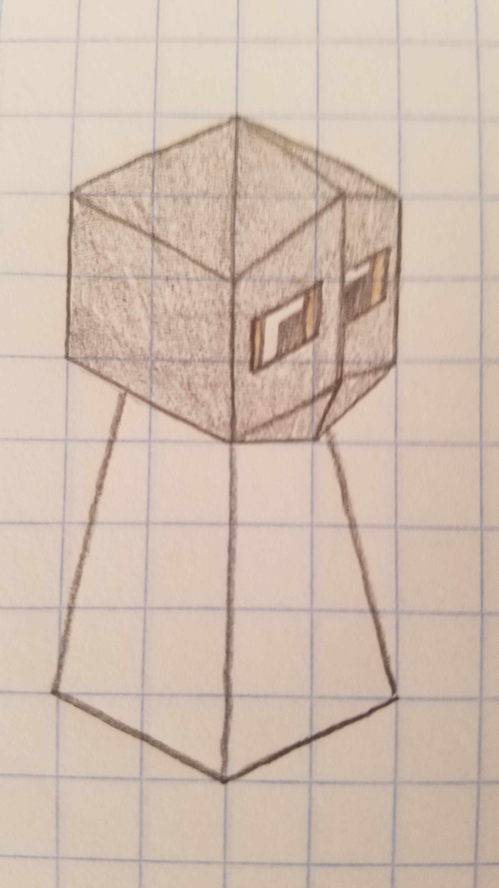
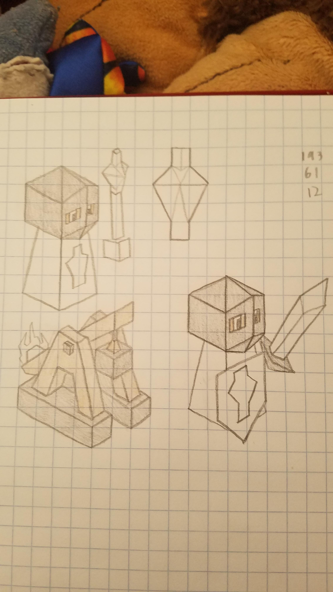

# Crusondar

*The Crusondar are a people who come from a square beyond ours. Now, they have found this one, and they are intent on ruling it. Bolstered by their religious fervour and powerful Templar units, they will not rest until this square accepts their religion and, more importantly, their rule.*

---

The Crusondar have powerful heavy cavalry, the Templar, which keep fighting even after  their horses are killed. Their attack is focused on fielding a few powerful and expensive units. 

And when converting stops working, bring out the Trebuchets

### Lore #1 for the Crusondar

The Crusondar citizens, those who do not take part in their great wars, partake in various activities. One of the most common is the board game known as Shatarani, designed to test the strategic thinking and develop the abilities of even the most average citizen to basically understand the Way of Conquest that the Crusondar follow.

### Lore #2 for Crusondar

The Crusondar did not come to this world by their own design. A Templar, on one of their patrols around their home square, discovered a portal. Unknown to them, it was a portal that the Mindranii had created aeons ago and abandoned, as it appeared to only lead to a barren corner of the square. However, the Crusondar, upon looking through it, discovered a land unlike any of their square, and sent out scouting parties. They came back with tales of a rich land, full of warring tribes, and the seraphim gave their blessing to conquer it. Thus, the Crusondar came to our square.

## Techs

Chivalry -> Templarism

Free Spirit -> Churches

Spiritualism -> Monasteries

Mathematics -> Siegecraft

Philosophy -> Holy War

Meditation
- no longer allows building of mountain temples

Aquatism
- no longer allows building of water temples

## Units

| replaces | name | cost | health | attack | defence | range | movement | skills |
|:---------|:-----|:----:|:------:|:------:|:-------:|:-----:|:----:|:-------|
| Knight | Templar | 8 | 15 | 3 | 2 | 1 | 2.5 | Dash, Dismount, Fortify |
| Mind Bender | Bishop | 7 | 10 | 0 | 1 | 1 (2) | 1 | Convert, Smite |
| Catapult | Trebuchet | 12 | 10 | 3.5 | 0 | 3 | 1 | Emplacement, Breaching |
| Warrior | Pilgrim | 5 | 5 | 0 | 0 | 0 | 1 | Convince, Diplomat |
| Giant | Seraph | N/A | 30 | 3 | 3 | 1 | 2 | Heal, Ward, Flight, Dash |

## Buildings

Church replaces Temple
- Cost: 15
- Produces 1 population
- Upgrades same as temple but 3/4 score per upgrade
- Any unit standing on a church gets +1 attack, provided it has 1 or above attack to start off with, to a maximum of 3.5
- One church per city
- Can be built on fields, forests and mountains

Monastery replaces Forest Temple
- Same as church, but heals 2 health per turn for enemies instead of a damage buff

Cathedral
- Unlocked after building at least 5 holy buildings
- Makes all holy buildings produce 3 stars a turn
- Only one per game

## Skills

Dismount
- Upon death, create a [swordsman] with [10] health

Smite
- An ability with attack 3
- if this kills the enemy it will chain to a random surrounding enemy and repeat the chain process twice
- activated ability

Emplacement
- Cannot attack unless it spends the turn before using the "Prepare" ability

Breaching
- Halves the defence of any unit attacked when it is on a city

Convince
- Can convert cities to ally with you (not take them over)
- They will continue to act in accordance with their tribe (creating troops, giving stars etc.)
- However, they will deal less damage to people of the Crusondar religion (including other converted tribes)
- You cannot convert the enemy capital
- Upon conquering the enemy capital, all converted cities of that tribe will join you
- Cannot conquer cities, only convert

Diplomat
- Enemies cannot attack this, apparently harmless, unit, until it shows it is an enemy.
- If they move too close to the capital (3 squares), they can be attacked
- Also, if you have previously attacked the tribe, pilgrims can be attacked.

Ward
- Give a target friendly unit and a random one bordering it 6 temporary hitpoints (active ability, 3 range).

# Images

Tribe colour is RGB colour 97, 2, 2

*Tribe hat (courtesy of @ThatOneKid (ThatOneConceptArtist))*

*Troops (bishop, holy symbol (not a troop), trebuchet, dismounted Templar)*
