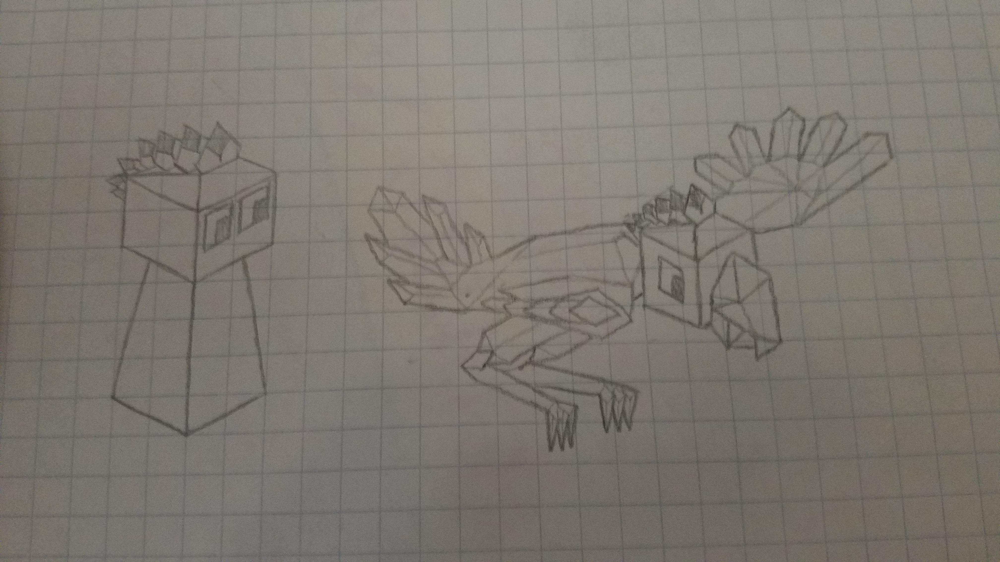

# The Gwèni (Gwae-nee)

*The Gwèni start their journey in the mountainous regions of Gwèniva, taming the legendary Qwìno birds for flight and war.*

---

The Gwèni start the game with the 'Bird taming' tech and a bird rider.

## Units

The Qwìno birds are similar to dragons but have 15 hp.

Bird shamans can use convert which can convert any huntable animal into a bird, which is the same as bird rider except it can move more spaces and has 20 health. It costs 10 stars to convert an animal.

## Visual Design

### Terrain

- Fruit: Squash
- Forest: Rainforests
- Mountains: Andes
- Animal: Qwìno (like ostriches)

### Other

- Hat: bird feather
- Color scheme: orange and purple with red ground

## Tech

Bird Magic replaces philosophy
- can train bird shamans

## Images

*Warrior and Qwìno*
