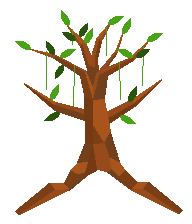

# The Laturis

---

*The Laturis respect nature and all plants. With magical tree and plant units they govern the their territory. Upon seeing the cruel treatment of nature by other tribes they have decided to end the disrespectful and cruel ways of the other tribes.*

## Units

| name | cost | health | attack | defence | range | movement | skills |
|:-----|:----:|:------:|:------:|:-------:|:-----:|:--------:|:-------|
| The Creeper | 5 | N/A | N/A | N/A | N/A | N/A | Creep |
| Walking Willow | 10 (created from a forest) | 20 | 4 | 2 | 1 | 1 | Dash |
| Forest Spririt | N/A | 40 | 4 | 4 | 1 | 1 | Scout, Grip |

## Skills

Creep
 - the skill that allows the creeper to function as a creeper
 - there can only be one creeper at a time
 - the creeper expands its vines each turn, one vine occupies one tile
 - the creeper grows by 3 vines each turn, at the start of your turn you decide where it grows
 - after 2 turns a vine dies
 - the creeper can grip an opponent unit which disallows the unit to move, it can still attack and defend
 - each creeper can only grip every unit once
 - a unit gripped by the creeper can kill the creeper by attacking it, if not it can wait out the time till it dies
 - if not gripped only these units can destroy the creeper:
   - any melee unit (warrior, defender, swordsman, knight ect) destroys only one vine and it has to be next to it
   - catapult destroys only one one vine but it does not have to be next to it
   - battle ship or ice fortress destroys all vines in a 3x3 radius of the vine attacked
   - fire dragon destroys all vines in a 5x5 radius of the vine attacked
 - if the vine is frozen (it cannot be frozen by a ice archer) it cannot grow from there and will die the next turn
 - a vine cannot grip a flying unit
 
## Mechanics

When cutting down forests, you need to pay 2 stars (for when you need to clear forests with few stars).

All plant units (Creeper, Wlking Willow and Forest Spirit canont go on boats).

Spawn rates (%)  
Field, empty 15  
Field, w. fruit 20  
Field, w. crop 15  
Forest, empty 20  
Field, w. game 15  
Mountain, no metal 5  
Mountain, w. no metal 10

When a park is built on a city, every 3 turns a forest grows in an empty tile (that means no crop or fruit).

The Forest Spirit can scatter silver dust on an empty tile, this produces crops on the tile.

They can grow fruit, these grown fruit give any unit on every unit (except super units) either dash or escape skill. When fruit is harvested by Laturis, it gives them 2 stars.

Any laturis unit in its own forest temple gets a x2 defense bonus.

*Walking Willow*
