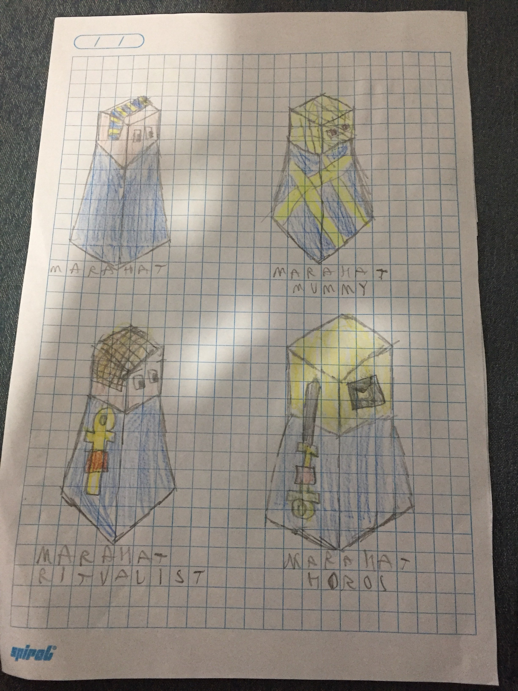

# The Marahat

---

The Marahat is an Egyptian based tribe, they live in a desert close to a river (they always spawn with a river in its biome). Their desert is very barren, but barren and full of ore. They start with Mining

If a unit dies within the Marahat’s borders, a tomb appears. Their special unit is the Ritualist that substitutes for the tech Shields. If the Ritualist goes in a tomb, you may spend one star to make the unit come back as a Mummy. If you decide to do so, the tomb disappears and the Mummy has less HP and Defense, but more attack. 

They have no fruit, but they do have oasis’s. Oasis’s give 1 population every 3 turns for 9 turns in total (3 pop total).

The animal is a giant scorpion called majartah 

Mummy stats:
HP: 2
Defence: 2
Attack: 3
Movement: 2
Range: 1

Super unit: Horos
Replaces giants

Altar of peace - sacrifice altar 
Emperor’s tomb - a pharaoh tomb
Park of fortune - buildings inside walls
Grand bazaar - ancient Egyptian market
Tower of wisdom - pillar with hieroglyphs
Gate of power - ancient Egyptian gate with hieroglyphs
Eye of god - Horus statue
