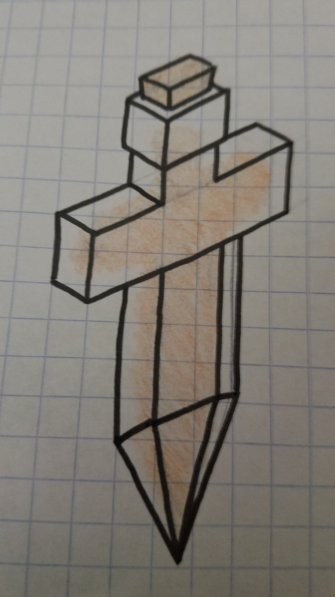
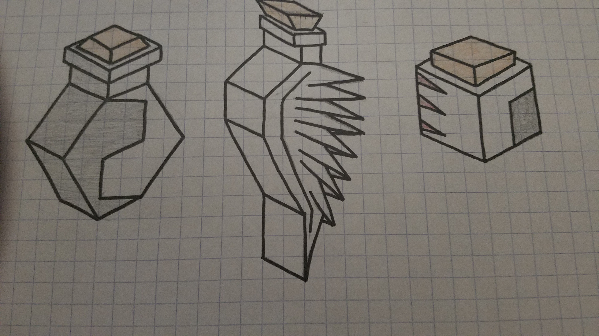

# Alchemistres

%233407-%237289DA)

*Elves, dragons, giants. In a world of such magic, is there not wizardry?*

---

*After running out of invisibility potions, the Alchemistres came clean about the fact that they even exist to the entirety of the Square. They have only 2 types of units... but that’s okay! Because they have lots of types of potions, which allow them to do dangerous things to their foes. Set their fields on fire! Poison them! Take a page out of the Polaris’ book and freeze them solid! Or, if you want something more positive, heal yourself, give yourself abilities of other units, or just give yourself more speed! Now you’re thinking with Alchemistry.*

## Units

The Alchemistres are weak, as they only have access to 4 units, 2 of which are super units.

These are the *only* units they have access to:

| name | cost | health | attack | defence | range | movement | skills |
|:-----|:----:|:------:|:------:|:-------:|:-----:|:--------:|:-------|
| Warrior | 2 | 10 | 2 | 2 | 1 | 1 | Dash, Fortify |
| Shade | N/A | low | 2 | 1 | 1 | 3 | Invisible, Dash |
| Basilisk | ? | ? | ? | ? | 1 | 1 | Eat, Tail |

## Skills

Invisible

- other players cannot see the unit
- no attack animation
- the only way to kill the unit is to have a unit occupy the same tole that it is in
- invisible units may occupy the same tiles as each other
    - when tapping on overlayed invisible units, a menu appears to decide which one you want to move

Eat

- when killing a unit, you restore health

Tail

- this unit takes up multiple tiles
- friendly units can move on top of them, except on their head
- when attacking a basilisk tail segment with another unit on, two balloons will appear (like when capturing a city)
    - one will be a tail segment, the other will be the unit standing on the segment
    - you choose one to attack

## Potions

Their strength comes in Potions, which can only be placed on any tile in the Alchemistre territory, and 1 tile away from any tile of said territory.
These potions can be used to upgrade your units and grievously harm others.

They may only throw potions 2 tiles away from their territory, or anywhere within it.

Potions are the main form of Alchemistran offense, either causing grievous harm to enemies by altering tiles or units, or buffing Alchemistran units.

### Damnatio
Fire potion, make 2x2 tile of fire. You step on it and you get damaged 5 times over every other turn. No, the alchems aren't immune. Fire tile dies after 3 turns.

### Arsenicum
Poison potion. Affects units in a 2x2 space. Makes all affected take 1 damage every time they attack someone, move, or have the alchems turn end. Poison ends after 3 turns as normal.

### Congelationis
See polaris, but slightly nerfed.

### Convertere
Using this expensive potion, all 3x3 tiles in its range become yours. Useful for messing with enemy borders, and also gives some breathing space for potion throwing.

### Divitiae
When you learn this tech, any enemy resources will leave an outline of where they were.  
Using divitae, you can steal them back, with an extra +1 population or +1 star for whales. Navalon incompatible.

### Simul
Take any skill from any other unit and put it on yours. Certain ones cost more stars. 

### Insanire
+5 strength to any unit of choice

### Celeritas
+3 movement speed to any unit of choice

Note: there is a tech that allows for "negative" version of these potions.
So that would mean -3 movement speed, -5 strength, delete a skill.
The potions would be named "Celeritas Negans" for negative, "Celeritas Positive" for positive (as an example).

You will have a different "Potions" tab with your tech tree tab, next turn tab, etc.

You are allowed to throw a single potion every turn, unless you get the tech that allows for increased potion capacity, in which case you can bump it up to 2, 4, and 5.

Instead of producing units other than your basic warrior, you can produce potions.

## Cosmetics

Their ambience is wind noises, crows cawing and sometimes the bubbling of potions.

Ground - Brown like Yadakk  
Mountain - Large stone spires  
Fruit - Pomegranates  
Native animal - Wingless hydras  
Trees - Spiraling beanstalks  

## Images

