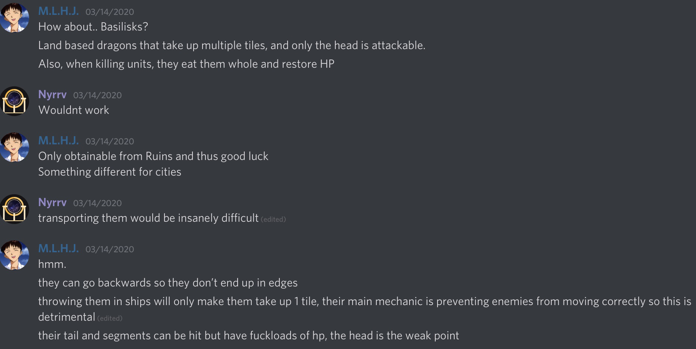

# Alchemistres

*Elves, dragons, giants. In a world of such magic, is there not wizardry?*

%233407-%237289DA)

---

*After running out of invisibility potions, the Alchemistres came clean about the fact that they even exist to the entirety of the Square. They have only 2 types of units... but that’s okay! Because they have lots of types of potions, which allow them to do dangerous things to their foes. Set their fields on fire! Poison them! Take a page out of the Polaris’ book and freeze them solid! Or, if you want something more positive, heal yourself, give yourself abilities of other units, or just give yourself more speed! Now you’re thinking with Alchemistry.*

The Alchemistres are weak, as they only have access to 4 units, 2 of which are Super units.
1 is a typical warrior. Nothing notable.

The first super unit is called a Shade. Shades are like explorers if they could fight. As a result of an invisibility spell, nobody, not even other players, can see them. They have no attack animation. The only tell is your opponents losing HP. 

They have the speed of a Knight and the strength of a Rider. However, their health...

The only way to kill a Shade is to have a unit occupy the same space that the Shade is in. Therefore, you must figure out where the Shade is before it’s too late.

Their strength comes in Potions, which can only be placed on any tile in the Alchemistre territory, and 1 tile away from any tile of said territory.
These potions can be used to upgrade your units and grievously harm others.

## Potions

Potions are the main form of Alchemistran offense, either causing grievous harm to enemies by altering tiles or units, or buffing Alchemistran units.

---

### Damnatio
Fire potion, make 2x2 tile of fire. You step on it and you get damaged 5 times over every other turn. No, the alchems aren't immune. Fire tile dies after 3 turns.

### Arsenicum
Poison potion. Affects units in a 2x2 space. Makes all affected take 1 damage every time they attack someone, move, or have the alchems turn end. Poison ends after 3 turns as normal.

### Congelationis
See polaris, but slightly nerfed.

### Convertere
I should mention this: you can only throw potions 2 tiles away from your territory, or anywhere in it. Using this expensive potion, all 3x3 tiles in its range become yours. Useful for f*cking with enemy borders, and also gives some breathing space for potion throwing.

### Divitiae
Let's imagine this scenario:
You see an enemy resource within your borders
You want that, to upgrade your city
F*cking oumaji b*stards are speedy enough to grab it first
Using divitae, you can steal it back
You can take it and make it yours, with an extra +1 population or +1 star for whales. Sorry, navalon incompatible. Oh, also, when you learn this tech, any enemy resources will leave an outline of where they were.

### Simul
Take any skill from any other unit and put it on yours. Certain ones cost more stars. 

### Insanire
+5 strength to any unit of choice

### Celeritas
+3 movement speed to any unit of choice

note: there is a tech that allows for "negative" version of these potions.
so that would mean -3 movement speed, -5 strength, fucking delete a skill 
as such, the potions would be named "Celeritas Negans" for negative, "Celeritas Positive" for positive (as an example)

also, you will have a different "Potions" tab with your tech tree tab, next turn tab, etc.

you are allowed to throw a single potion. every turn. no more. unless you get the tech that allows for increased potion capacity. in which case you can bump it up to 2, 4, and 5.

instead of producing units other than your basic *ss warrior, you can produce potions instead

Alchemistran units can move on Basilisk spaces.
Unless it’s the head.
That they can’t.
Ground - Brown like Yadakk
Mountain - Large stone spires
Fruit - Pomegranates
Native animal - Wingless hydras
Trees - Spiraling beanstalks

When attacking a unit on a basilisk space, 2 icons will appear like when capturing a city, or making somebody a Veteran.
One will be a tail segment. The other will be the Polytopian standing on the segment.

A shade can occupy a shade with no harm.
When tapping on an overlayed shade, you will bring up a menu showing which shade you want to move.

Their ambience is wind noises, crows cawing and sometimes the bubbling of potions.
