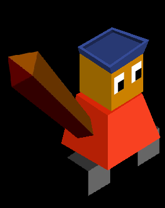
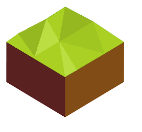

# Armâda

*The Armâda are the masters of the Sea's of the square and there is no water too hard for them to conquer.*

---

The Armâda start with the 'Sailing' tech.

### Their spawn rates:

Water: 50%  
Land: 10%  
Land, fruit: 5%  
Land, crop: 5%  
Forest: 5%  
Forest, game: 10%  
Mountain: 5%  
Mountain, ore: 5%  

They always have at least 2 water tile in their starting border.  
They start with a boat in one of the water tiles next to their capital.  

Animal: Lynx

### Parts forming the cities names

Ar O Se Ña U Jâ Ing Rî Ta I Sa Jo LL No Y D

LL is pronouced Y (/j/ not /i/)

## Images

