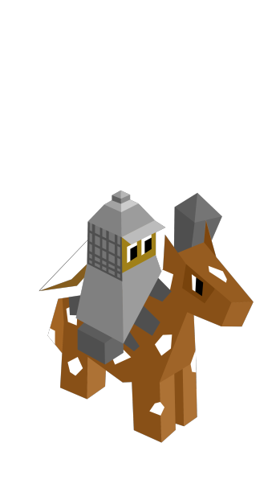
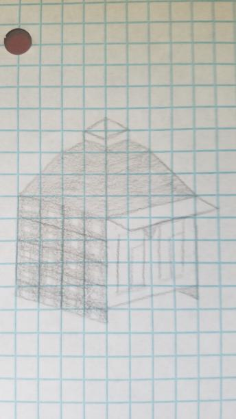

# The Balkhanu

*The Balkhanu were originally a group of nomads that wandered their empty terrain relatively peacefully. One day they saw members of a group called the Xin-Xi tribe coming into their territory and claiming Balkhanu Villages for their own. This put the Balkhanu into a fury, and they decided they would take back what was rightfully theirs and teach the Xin-Xi (and other threatening tribes) a lesson.*

*The Balkhanu kept pieces of their nomadic lifestyle alive, establishing temporary outposts to attack empires from where they would least expect, and also perfected a new combat unit that would strike fear in the eyes of enemies.*

---

The Balkhanu start with a level one capital and the Free Civilization tech. The tribe colour is a steely grey.

## Techs

Free Spirit -> Free Civilization

- also unlocks the creation of outposts

Chivalry -> Brutality

- allows the creation of warhorse units instead of knights

## Buildings

Outposts

- cost 14 stars to build
- can be sieged like cities
- when "captured", it is destroyed and the capturer gets 5 stars
- max three in existence at any one time
- like cities, give a defence bonus to units with fortify
- if all your cities are lost, but you still have outposts, you are not eliminated
- produces 1 star per turn, or 2 if connected by roads to your capital
- can produce units like a city (but no super units)
- can be built anywhere but in enemy territory
- if it becomes inside enemy territory (eg. via border growth), the enemy must destroy it before building on its tile

## Units

| replaces | name | cost | health | attack | defence | range | movement | skills |
|:---------|:-----|:----:|:------:|:------:|:-------:|:-----:|:--------:|:-------|
| Knight | Warhorse | 14 | 15 | 3 | 2 | 1 | 3 | Dash, Piercing Shot, Semi-Escape |

## Unit Skills

Piercing Shot

- can be activated like heal, and only when the unit has not moved this turn
- the unit gains 2 range, and ignores defence bonuses

Semi-Escape

- can move one third of their movement stat after attacking

## Terrain

Animal: Mungalu - A brownish, white spotted horse-like with shorter legs than the Xin-Xi and Imperius variants.

Fruit: Casil - Four large, black, berries that resemble the black currant fruit.

Mountain: A winding mountain of crooked shape that has a small stream flowing through it.

Forest: Large trees (3 in a tile) resembling the *Ulmus macrocarpa*.

Field: Yellow-green (not quite as yellow as Zebasi's).

## Terrain Modifiers

Increased mountain and land, greatly decreased forest. The Balkhanu cannot start with any water tiles in their city unless the map is a water world

## Images

