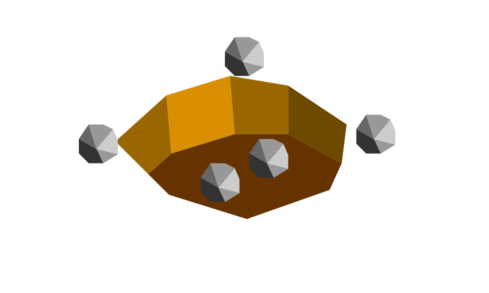

# Crysjhem

*The Crysjhem have lived in crystal and rocks for generations. They now harness these beautiful gems to their benefit. However, their beauty doesn't go unoticed...*

---

## Techs

Farming -> Terramining
- unlocks quarry which replaces farms

## Buildings

Farm -> Quarry
- produces one pop and 1 star

Mine

- produces 3 pop

Forge -> Jewel Cast
- produces 2 stars for every nearby mine or quarry

Windmill -> Crystal Tower
- produces 1 pop for every nearby mine or quarry
- makse the 8 tiles surrounding it have infinite movement point cost (like mountains)

## Images

*Their warrior*

*The quarry*
