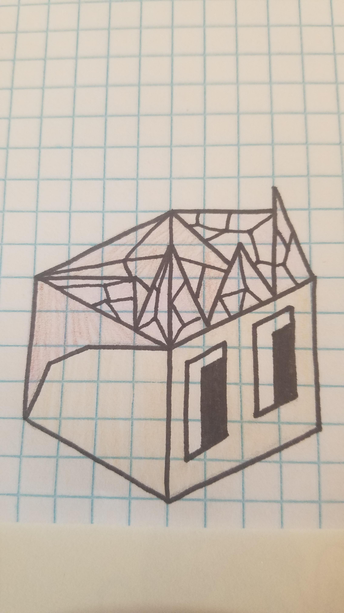

# The Congregation of Enoril

*The Congregation of Enoril do not cling to the beliefs of one tribe v.s. another as they themselves do not even have a real name like Xin-Xi or Hoodrick. They inhabit the most inhospitable place on the Square, on the borders of the Vengir wastelands where the soil is still toxic to trees but hasn't softened enough to allow farming like the inner parts either. To survive they have learned to keep faith in themselves, and in the mystical being they worship known as "Enoril".*

---

Starting Techs: Free Spirit, Philosophy. Their starting unit is a mind bender.

## Spawn rates

Reduced farms, fruit and fish; greatly reduced forests. No resources spawn within the initial border of their capital.

## Terrain

Fruit: little grayish shrubs with 2 white berries on them, one shrub per fruit tile.

Animal: Rhini - similar in appearance to Vengir's Rhinopig, but grey and taller (basically a Rhino).

Field: Grey, with patches of black.

Mountain: Double peaked, dark grey, with snowy caps.

## Other visual design

They have Cathedral-esque buildings, one of which has a cupola with a bell

The tribe colour is a very light pink.

## Images

