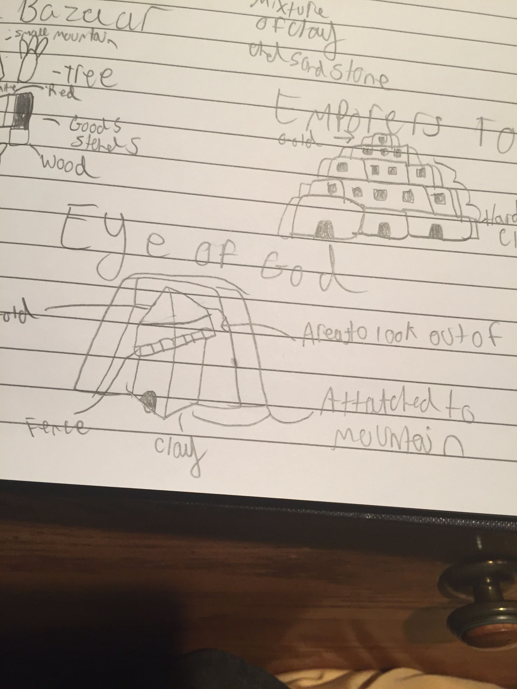
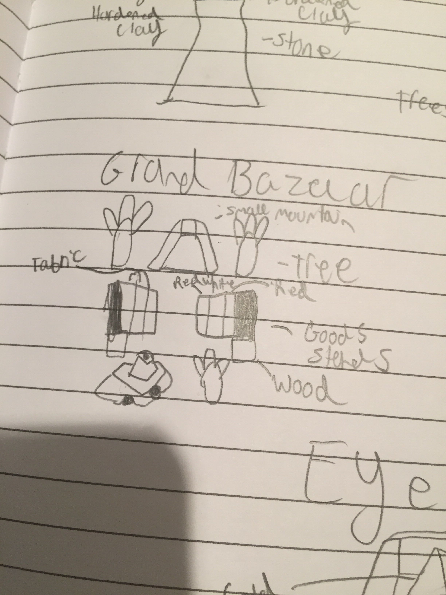
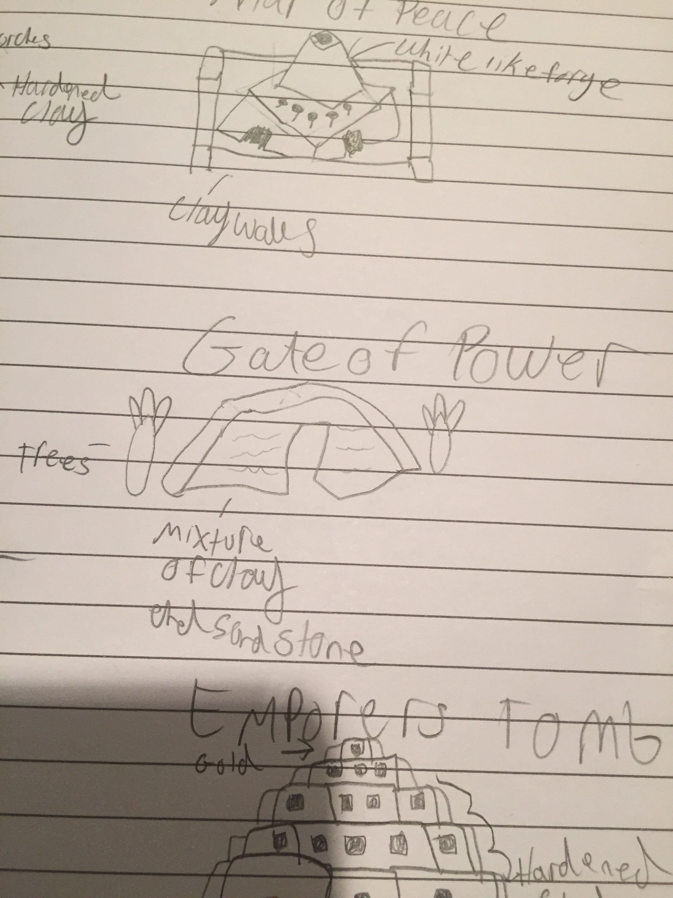
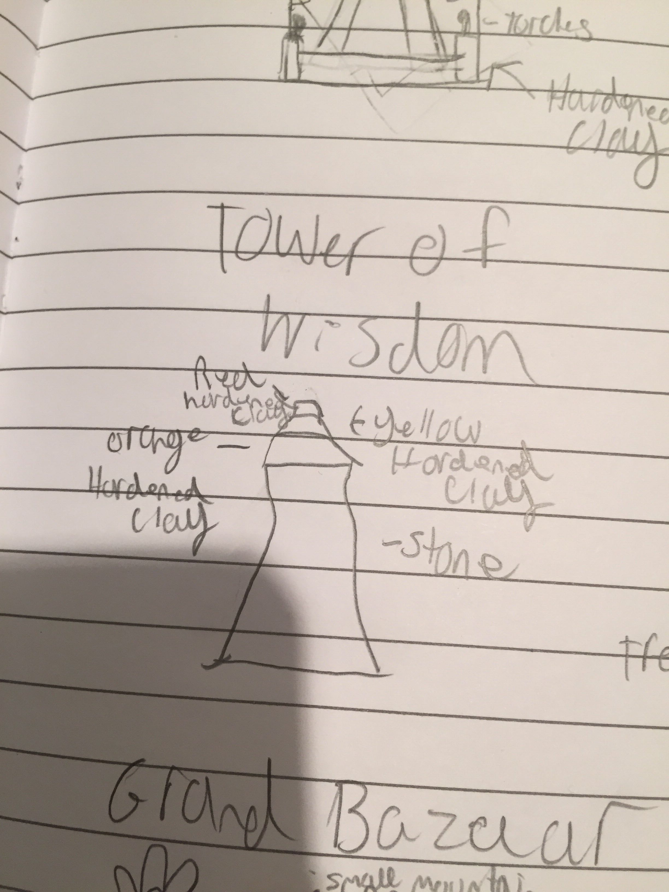
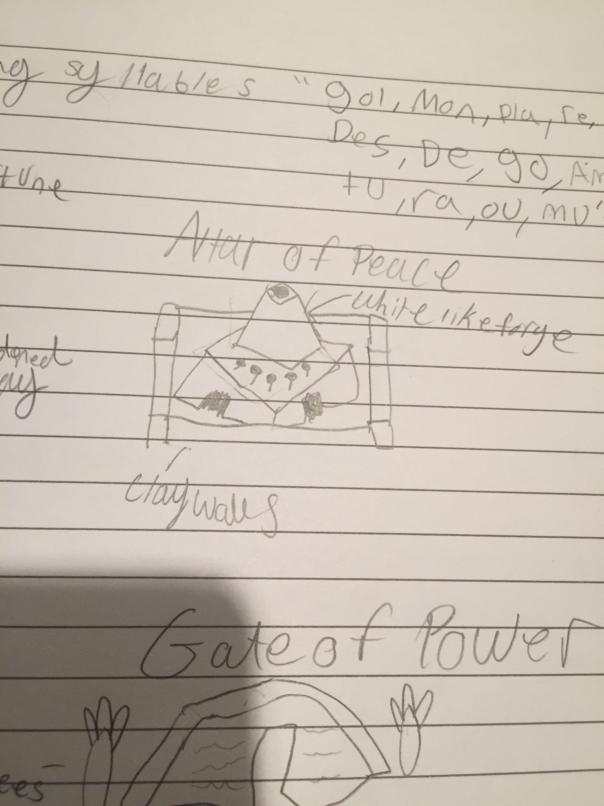
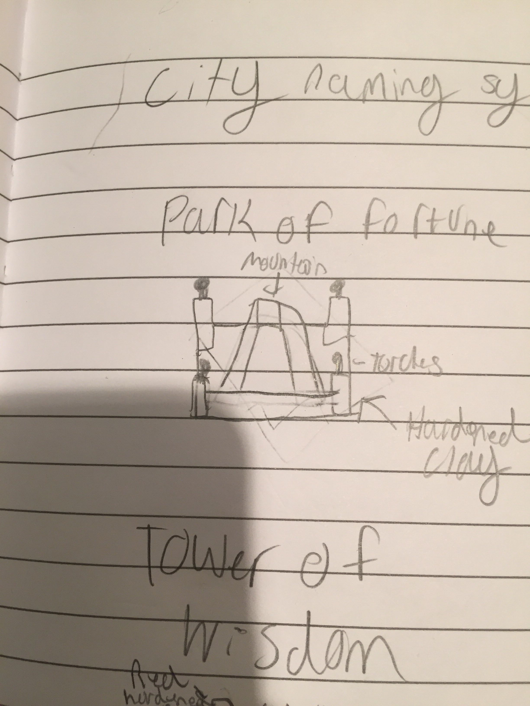
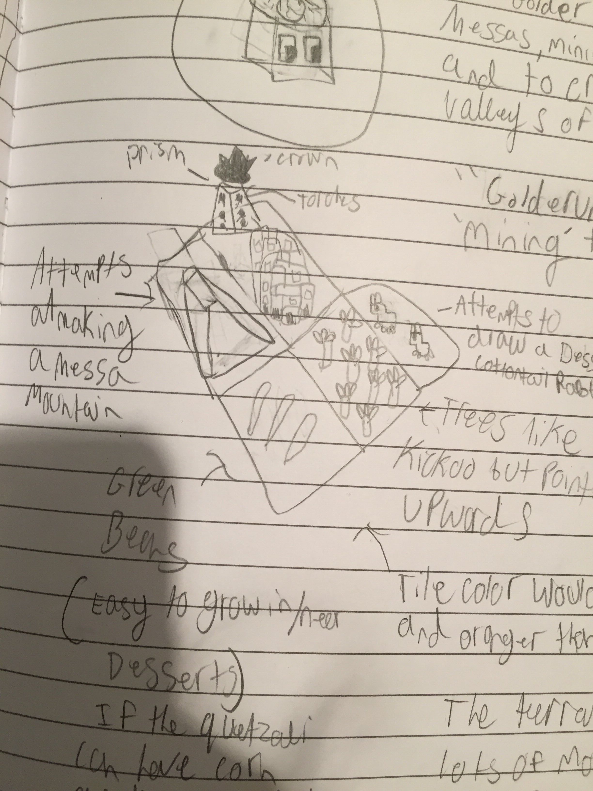

# Golderùm (Gol-dur-oom)

*The Golderùm tribe inhabits the squares mesa's. Mining and selling to make profit and to create bustling cities in the valleys of the mesa.*

---

Golderùm starts the game with the mining tech.

## Spawn rates

Mountains+
Ore+
Fruit-
Animals-
Forests-

## Visual Design

### Colours

- Ground: orange (more so than Oumaji but not so much as Zebasi)
- Borders: brownish dark orange

### Terrain

- Fruit: green beans (a food able to easily grow in heat)
- Trees: similar to kickoo but the leaves pointed downwards and less saturated
- Animal: 2 rabbits based off a cottontail rabbit native to the dessert of North America (riders and knights ride big rabbits)
- Mountains: Mesas

### Buildings

- City buildings: similar to Pueblo style houses
- Capital prism: a normal shape with torches on the walls

## City name syllables
Gol Mon Pla Re Des De Go Am Tu Ra Ou Mu

## Images

