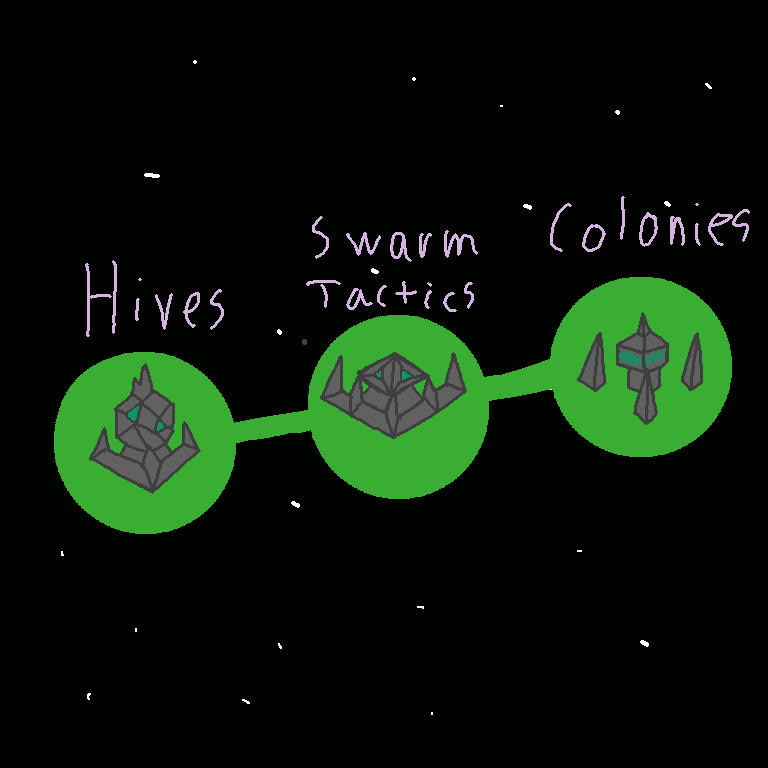
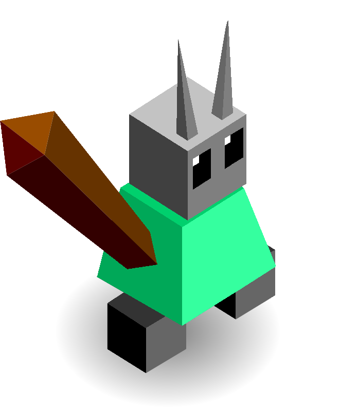
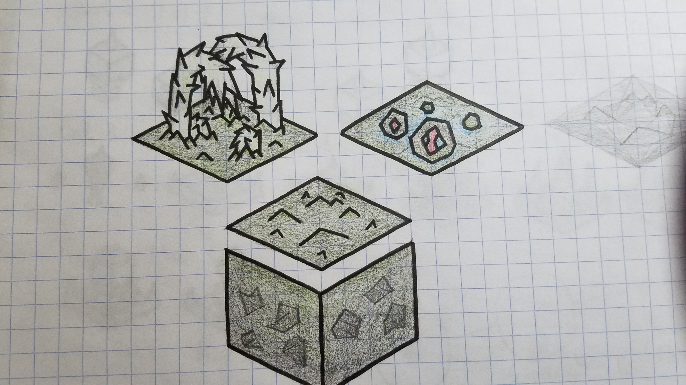
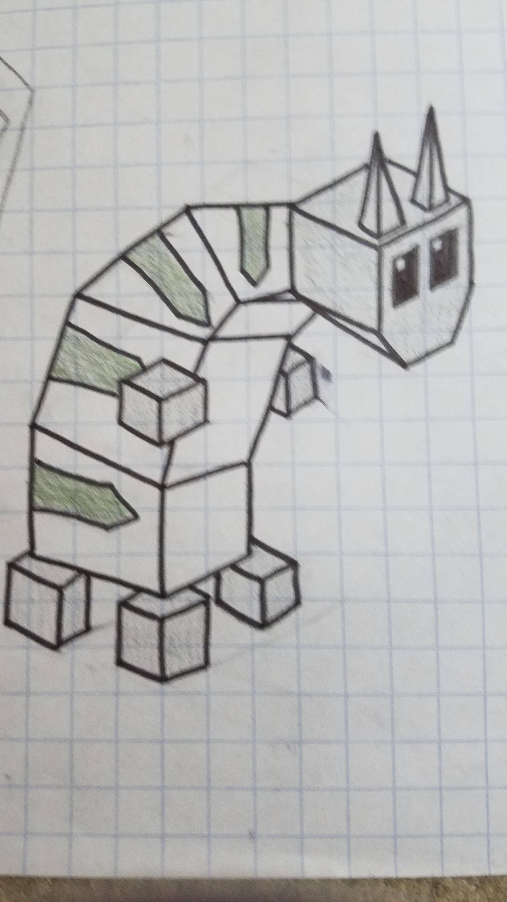
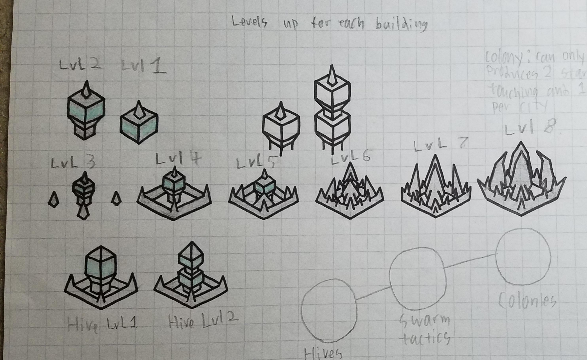

# Hyvers

*Deep beneath the square, a race of insects gained intelligence after discovering a mysterious substance. And they watched the creatures of the world above, and slowly learned their ways and their powers. Over the eons, they grew in power and size. Now from below the square, they rise to gain power over the tribes that they idolized.*

---

The Hyvers start out with modified building techs and a different tech tree.

## Techs

Hives

- allows you to build hives

Swarm Tactics

- allows you to upgrade your hives for 3 stars

Colonies

- gives you the destroy building and allows you to build colonies

## Buildings

Hives

- cost 2 stars
- can be built on any empty tile
- can be upgraded to "Upgrade Hive" for 3 stars with the "Swarm Tactics" tech

Upgraded Hives

- give 1 more population
- can train a unit

Colonies

- cost 20 stars
- one per city
- give 2 stars per turn for each building adjacent to them
- give 1 star per turn for each building in their city

## Images

