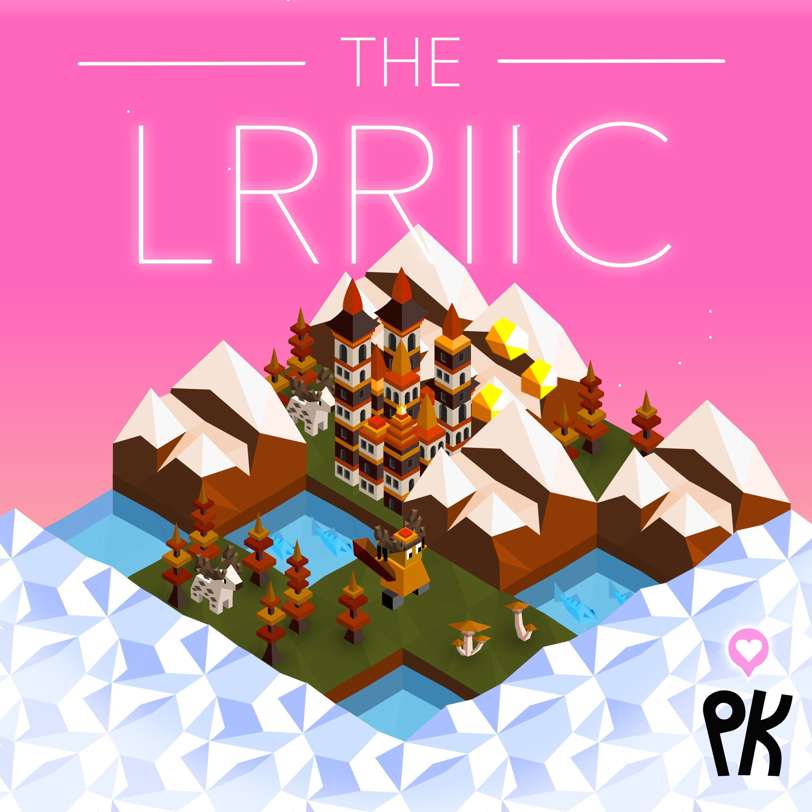

# The Lrriic

---

## Techs

Factories

- allows building factories

## Units

| name | cost | health | attack | defence | range | movement | skills |
|:-----|:----:|:------:|:------:|:-------:|:-----:|:--------:|:-------|
| Phantom | 2 | 15 | 1 | 3 | 1 | 1 | Energy based, Transparent |

## Skills

Energy based

- does not increase the unit count of the city it was built at
- cannot heal, or capture cities

Transparent

- does not take retaliation damage

## Buildings

Factory

- costs 1 star and 1 population to build
- produces 2 stars per turn
- can be built on any land tile within your territory, including mountains.

## Terrain Modifiers

-fish  
--crop  
++mountain  
-metal  

## Images

