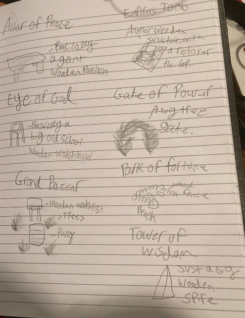
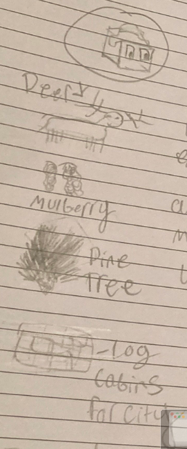

# Lumber-in

*The Lumber-in are a forest dwelling tribe, who becomes masters of their environment. Cutting down wood for everyone’s daily lives. Until, eventually supply ran out, and the have appeared unto the square, for more materials.*

---

Lumber-in start the game with the forestry tech.

## Spawn rates

Decreased water and crops, greatly decreased forests. Increased fish, greatly increased mountains.

## Visual design

### Terrain

Animal: Deer

Mulberry: Fruit

Forest: Pine tree

Field: Dark green, similar to Quetzali

### Monuments

Altar of Peace: A giant wooden pavillion

Emporers Tomb: A wooden structure with a roof

Eye of God: A very big old-school watch tower

Gate of Power: A big tree gate

Grand Bazaar: A rug surrounded by trees, and a wooden watchpost

Park of Fortune: Benches surrounded by a wooden fence

Tower of Wisdom: A big wooden spire

### Other

Cities: Log cabins

Tribe colour: Dark brown, similar to Yaddak

## City name syllables

Be, Ot, Ta, Twa, To, Ro, N, Ed, No

## Images

