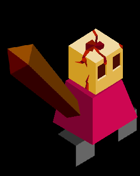

# Melgursh'k

*A massive creature made out of flesh, covering the tribe's terrain. The tribespeople bear a psychic connection with it, and wish to strengthen it by stealing resources from its surroundings by way of the Maw and Tendon.*

---

The Melgursh'k cannot upgrade any city other than capitals. All cities captured from enemies revert to level one as well, unless they are the capital of another empirel. The normal cities will not have a population bar. If a Melgursh'k city is captured by an opponent, all tribe-specific buildings like maws and tendons are destroyed in the process. Any roads that the Melgursh'k take possesion of are also destroyed.

## Buildings

Gaping Maw
- 10 Stars
- large mouth-like structure protruding from the ground
- must be placed 3 spaces apart at the minimum
- all population from resources and buildings within one tile of a maw are givin to the capital that it is connected to with a tendon
- this makes up for the tribe's inability to upgrade other non-capital cities
- can only be placed inside the territories belonging to your tribe

Tendon
- replaces roads
- connects Maws to capitals
- functions just like their normal counterpart, but do not connect to normal cities, only capitols and maws
- cannot be on a tile that a building is on
- can be destroyed, unlike roads
- can only be connected to one capital, otherwise it will turn into a useless "Dead" Maw until it is only connected to one capital
- still functions as a quick travel method for units

## Techs

Tendons replaces Roads
- allows building Maws and Tendons
- allows training Vorkali

Trade
- also allows training Leechers

## Units

| name | cost | health | attack | defence | range | movement | skills |
|:-----|:----:|:------:|:------:|:-------:|:-----:|:--------:|:-------|
| Vorkali (quadrupedal, spider-like) | 8 | 10 | 2 | 1 | 1 | 1 | Paid |
| Leecher | ? | 15 | 2 | 2 | 1 | ? | Dash, Spawn Leech |
| Leech | 1 | 3 | 3 | ? | 1 | ? | Leech |

## Skills

Paid
- upon killing a unit, collect stars from it equal to its disband cost

Spawn Leech
- can create one Leech with its turn, with a cap at three Leeches per Leecher

Leech
- all of the damage dealt by a Leech is given as health to the Leecher

## Images

*Melgursh'k Warrior*
