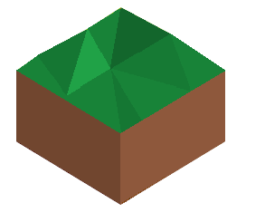
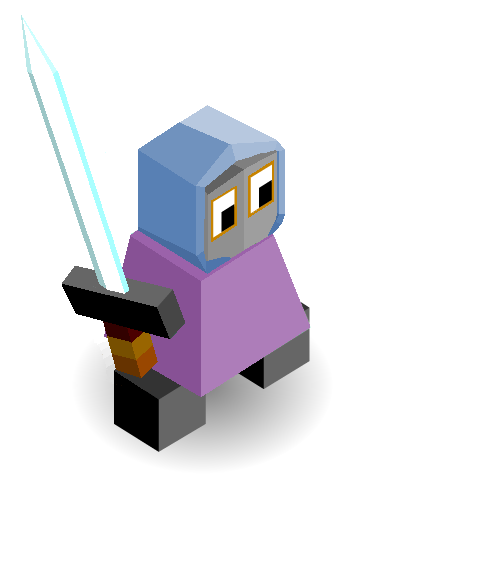

# Mindranii

*The Aethergates can only be formed by the release of a huge burst of aetherial energy. The Mindranii can do this in controlled environments of course, but on the field of battle the only way they have found of executing this maneuvre is the shattering of the blade of an Aetherknight, thus releasing enough energy to be manipulated into an Aethergate by an Aethermancer.*

---

The Mindranii start with climbing.

## Techs

Philosophy -> Education  
- Unlocks university building  

Meditation -> Stargazing  
- allows the construction of an Observatory building

Smithery -> Aethermancy  
Navigation

## Buildings

University

- provides 1 population
- reduces tech costs by 3-5% (not sure yet) of the initial cost
- one per city 
- cost: 7

Observatory

- allows you to reveal one tile at the start of the turn
- it randomly picks an undiscovered tile. Maybe it is more inclined to pick tiles near enemies?
- There can only be one built at any time
- Cost 20 stars

The Aethergate

- Upon creation, you choose an exit tile. This exit tile must be:
    1. no closer than 2 tiles away from your border
    2. not in enemy territory
    3. not on a unit
    4. on a land tile
- The exit is marked by a blue sparkly rim around the tile
- This is visible by any team
- Moving a friendly unit onto the Aethergate will cause them to teleport to the exit and end their turn
- An enemy unit will destroy it and the exit
- Units cannot move from the entrance to the exit if there is a unit on the exit
- Instead, they will move as soon as the exit is clear, EVEN IF IT IS CLEARED ON AN ENEMY TURN
- If an enemy moves on an exit, both ends are destroyed.

## Units

| name | cost | health | attack | defence | range | move | skills |
|:-----|:----:|:------:|:------:|:-------:|:-----:|:----:|:-------|
| Aetherknight | 8 | 15 | 3.5 | 2 | 1 | 1 | Dash, Blink |
| Aethermancer | N/A (super unit) | 25 | 3 | 3 | 2 | 1 | teleport, scholar, heal |

## Abilities

Blink
 - Allows this unit to move 3 tiles ignoring all movement barriers
 - Tiles are only revealed if an enemy is on them
 - You are still able to attack after blinking.
 
Shatter
 - destroys the unit and creates an Aethergate in its place
 - there must be an Aethermancer adjacent to the Aetherknight

Teleport
 - allows you to move a unit within a 5x5 square around you to another empty land square in that area
 - This ends that unit's turn unless it has persist or escspe
 - You may not teleport onto Aethergates

Scholar
 - Allows use of Shatter active ability for all surrounding Aetherknights
 
## Terrain

Trees: silver birch  
Animals: drakes (they are sort of like small wingless dragons, but clever, which fits the theme of this being a big brain tribe)  
Fields: same colour as pine trees (sort of dark green)  
Fruit: Holly berries (no idea why, it just seemed like a good one)  
Mountains: tall with snowy peaks, pointy  

## Images

(The hat of the aetherknight is for them only. All others have the aethermage's beard and hat.)
