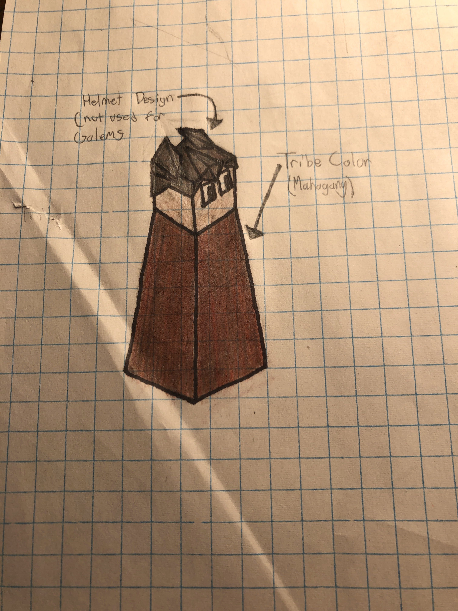
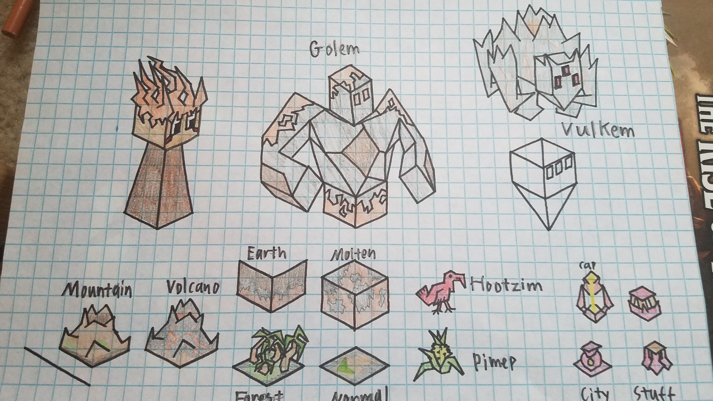

# Multarius

*The Multarius are a tribe that was trapped into the volcanic terrain of their present home, where they learned the skills and developed the abilities necessary to survive. With the power of Golems and Volcanoes in their grasp, they are now free to spread into the outside world to expand their civilization.*

---

## Units

| replaces | name | cost | health | attack | defence | range | movement | skills |
|:---------|:-----|:----:|:------:|:------:|:-------:|:-----:|:--------:|:-------|
| Giant | Golem | N/A | 20 | 5 | 4 | 1 | 1 | Explode, Mountaineer |
| Archer | Fire Archer | 3 | 10 | 2 | 1 | 2 | 1 | Dash, Fortify, Burn, Lava Immunity |
| Swordsman | Vulkem | 5 | 20 | 3 | 3 | 11 | 1 | Dash, Fortify, Ranged, Mountaineer, Lava Immunity |

## Skills

Explode

- deals 15 damage (exactly 15, ignoring any defence) to surrounding units upon death
- also inflicts the burn effect on them

Mountaineer

- has increased movement and defence in mountains.

Burn

- inflicts the burn effect on targets

Lava Immunity

- immune to the effects of lava

Ranged

- cannot attack units within 5 tiles

## Buildings

Volcanoes

- turn the four immediate tiles to their sides to lava
- lava inflicts the opponent with the burn effect
- for every turn a unit ends in lava it is dealt 5 damage
- can only be built on top of mountains
- cost 15 stars to make
- only three may exist at a time

## The Burn Effect

The Burn effect deals 2 damage to the unit for the next two turns after it is attacked. it does not effect frozen units. The effect can be removed by having a unit take a turn to put itself out.

## Images

