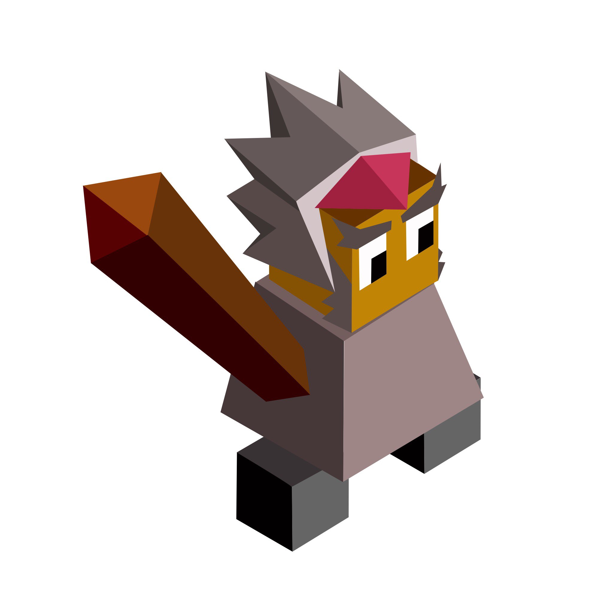

# Nocturnus

*The savage tribe nocturnus came from the dark forest, where they learned the secrets of the animals. The nocturnus warriors are savage even in the human form.*

---

The Noucturnus start with the transformation tech.

## Tech

Transformation replaces Meditation

- allows you turn the Nocturnus warriors into powerful werewolves for 3 turns costing 3 stars

Noturnization replaces Philosophy

- turns giants into werewolves for 8 turns, costs 10 stars
- unlocks the bat, which replaces the mind bender

Soul Storage replaces Hunting

- allows building the soul storage building

Spiritualism

- unlocks the moon caller building, 

Fangs replaces Riding

- unlocks the wolf unit

## Buildings

Soul Storage

- gives you five stars when you hunt 5 animals

Moon Caller

- transforms all warriors in the square into werewolves when you kill 20 enemies
- youmust to pay 10 stars to do this
- only the warriors who are not yet transformed are transformed with this building

## Units

| name | attack | defence | range | movement | skills |
|:-----|:------:|:-------:|:-----:|:--------:|:-------|
| Werewolf | 3 | 2 | 1 | 2 | Dash, Fortify, Hunt |
| Giant Werewolf | 5 | 4 | 1 | 2 | Hunt |
| Wolf | 2 | 1 | 1 | 3 | Fortify, Cross, Escape, Dash |
| Bat | 0 | 1 | 2 | 1 | Curse, Heal |

## Skills

Hunt

- the animals surrounding this unit can be hunted

Cross

- if the target has an some empty tile around it, the wolf can jump to the tile
- if there is more than one tile empty the player chooses which tile the wolf will jump to

Curse

- the unit's targets turn into bats

## Cosmetics

Animal: Sheep  

Mountain: High mountain with a cave entry in the middle (red eyes can be seen in the cave).  

Forest: Gray trees with black leaves.  

Fruit: Nightvenos, only trained warriors of nocturnus can eat this fruit, since it's very poisonous (based on the nightshade plant).

## Images

