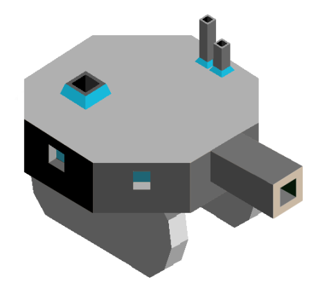

# Poartia

*Coming from one of the darkest squares, they have evolved so much that their technologies are thousands of years more advanced than any of the other tribes' techs. They have managed to travel to a new using teleportation, where, after destroying the civilastions there, they have teraformed that square to meet their needs. Now, they have come to our Square, prepared to destroy everything, but will they be successful?*

---

## Techs

Water Factory replaces Aquatism

- allows building of the water factory

Bioforming replaces Forestry

- allows spawning fruit on a tile for 3 stars

Mathematics

- allows training the Terra Mech

Industry replaces Chivalry

- allows building Factories

## Buildinggs

Water Factory

- mostly the same as same as the temples
- when there is a naval unit on them, that unit gets +3 health
- max 2 per city
- costs 10 stars

Factory

- can be switched to either economy mode or attack mode
- in economy mode, the factory produces one star per turn for every forge around it
- in attack mode, the factory can boost a unit each turn
- boosted units gain +2 health and +1 damage for 3 turns
- max 1 per city

## Units

| replaces | name | cost | health | attack | defence | range | movement | skills |
|:---------|:-----|:----:|:------:|:------:|:-------:|:-----:|:--------:|:-------|
| Catapult | Terra Mech | 8 | 12 | 3 | 2 | 2 | 1 | - |
| Giant | Tripod Stage 1 | N/A | 20 | 2 | 2 | 1 | 2 | Grow 1, Move Enemy |
| Giant | Tripod Stage 2 | N/A | 25 | 2 | 3 | 1 | 2 | Grow 2, Move Unit |
| Giant | Tripod Stage 3 | N/A | 30 | 4 | 4 | 1 | 2 | Move Unit, Remove Roads |

The Terra Mech is a steam-based bio-machine, and attacks using a jet of boiled water.

## Skills

Grow 1

- this unit will grow into a Tripod Stage 2 after 2 turns

Grow 2

- this unit will grow into a Tripod Stage 3 after 2 turns

Remove Roads

- this unit can remove up to 2 enemy roads each turn

Move Enemy

- can move any enemy unit within 2 tiles to another square within 2 tiles
- this does not take up a turn
- this may only be used once per turn

Move Unit

- like Move Enemy, but also works for friendly units

## Spawn Rates

Greatly decreased animals, greatly increased fruit and mountains.

## Cosmetics

Fruit: Light Herbs, they have a taste that is sweet and also sour, look like pomelos, but are red and glowing.  

Forests: Tall birch trees, with a red colored trunk, and very, very light green leaves.  

Animals: Pengogs - little animals that look like pigs.  

Mountains: Covered with water on the bottom, extremly tall, and some are snow capped.

## Images

