# Symõknã

*The lands of Symõknã have long been shrouded in smoke. Rumours had it that the people who lived in this land were gone for good cause of the ash. They soon saw a thick grey wall around themselves and knew that the Symõknã were coming to conquer the square.*

---

They are a smoke tribe and they have two special units, the Smoke Catapult and the Smotker, the super unit is the billower. They begin with the mining tech and smotker.

## Units

| replaces | name | cost | health | attack | defence | range | movement | skills |
|:---------|:-----|:----:|:------:|:------:|:-------:|:-----:|:----:|:-------|
| None (unlocks with mining) | Smotker | 5 | 15 | 2 | 2 | 1 | 2 | Fortify, Smoke, Dash |
| Catapult | Smoke Catapult | 8 | 10 | 0.5 | 0 | 3 | 1 | Ranged smoke |
| Giant | Billower | N/A | 4 | 30 | 5 | 2 | 2 | Ranged Smoke, Dash |

## Skills

Smoke

 - when used produces a 3x3 tile smoke
 - in smoke, no other tribes can see any units in the smoke 
 - player can see his own and opponents' units in the smoke
 - opponents' units will not be able to be used until smoke clears
 - smoke automatically clears after 1 turn unless a symokna troop smokes the area again
 - symokna player can see his own and opponent units and can perform any actions in the smoke as if it were not there

Ranged smoke

 - same as smoke except you are able to smoke an area not directly next to you.

## City name parts

Thõ Hẽz Rã Ĩ ã Mãs H Ẽk Õõn Nã Lẽã Dẽn Ãy Pãv Lãũ

## Buildings

Smoke house

 - produces 2 pop for every animal nearby
 
Mountain temple (modified)

 - when it becomes level 3 or higher, a smoke appears over it
 - any unit that is on the mountain will automatically heal 5 health.

## Spawn rates

Field, nothing: 15%  
Field, furit: 10%  
Field, crop: 15%  
Forest, nothing: 10%  
Forest, game: 5%  
Moutain, nothing: 20%  
Moutain, ore: 25%  
(at least 1 mine in the starting territory)

## City parts

The prism: Have three chimneys built into it on each side  
Parts of the city:

1. House eith tile roof and chimney
2. Wooden house (like Bardur) with chimney
3. Cube like brick chimney tower with windows
4. Grey building, similar to a forge, with smoke coming out
5. Similar to the smoke house

## Techs

Hunting

 - also unlocks the smoke house

Mathematics

 - unlocks smoke catapult (r. catapult)

Mining

 - unlocks the smotker
 
(There are no name changes for the techs)

## Music

Their music is a low minor music, with windish instruments. The ambience is the wind howling and occasionally a fire crackle.

## Images

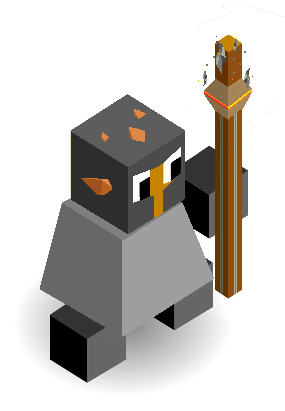

*The Smokter*

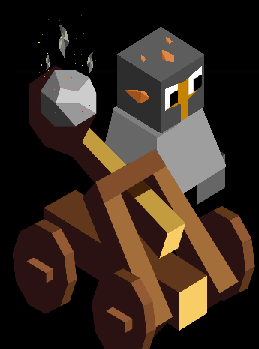

*The Smoke Catapult*

*A Symokna Warrior*

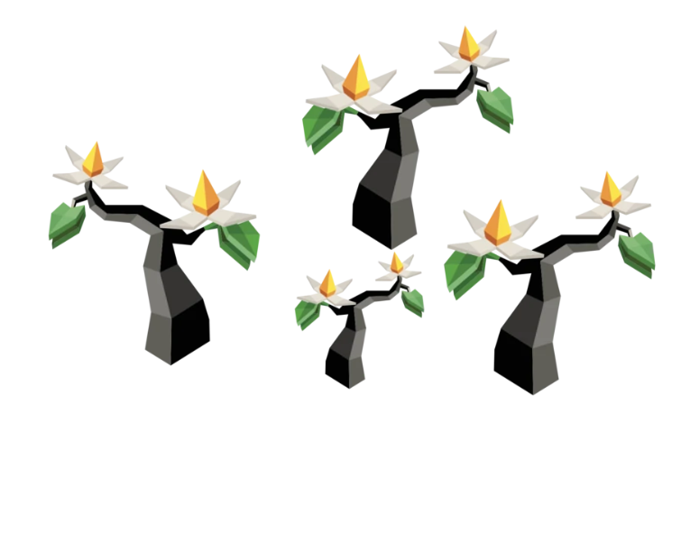

*They live near Yadakk and so have the Kahlee trees*

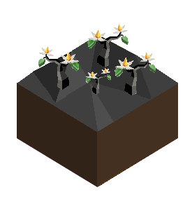

*Full Picture*

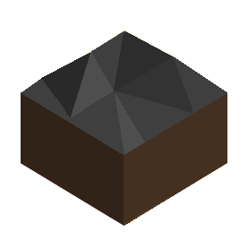

*Their Land*

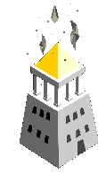

*Smoke above the mountain temple*

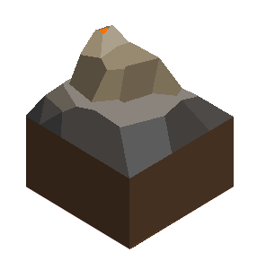

*Mountain*

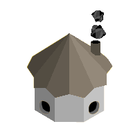

*Smoke House*

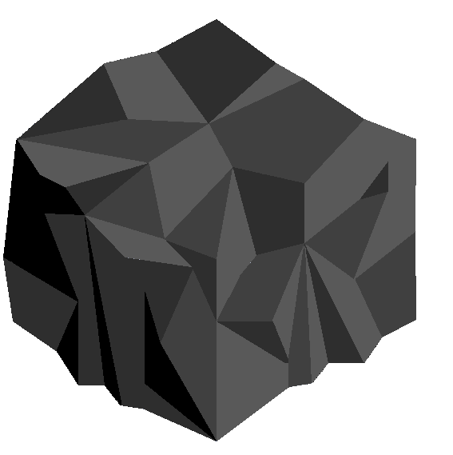

*Smoke that covers the 3x3 radius*

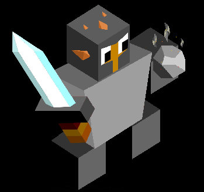

*The Billower*

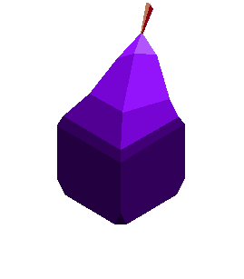

*Sprite for the fruit*
