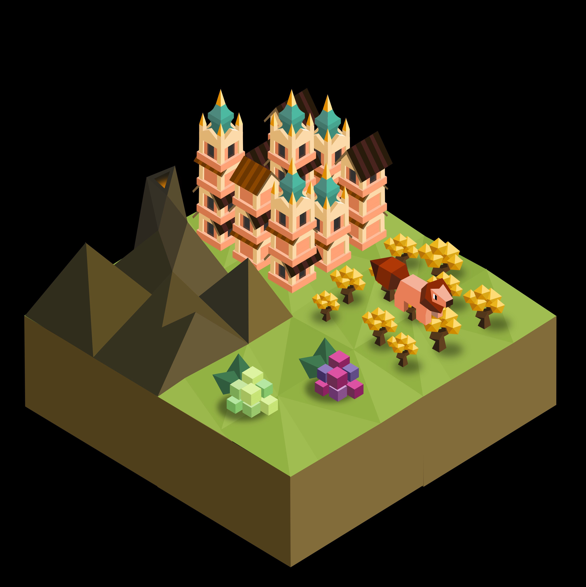
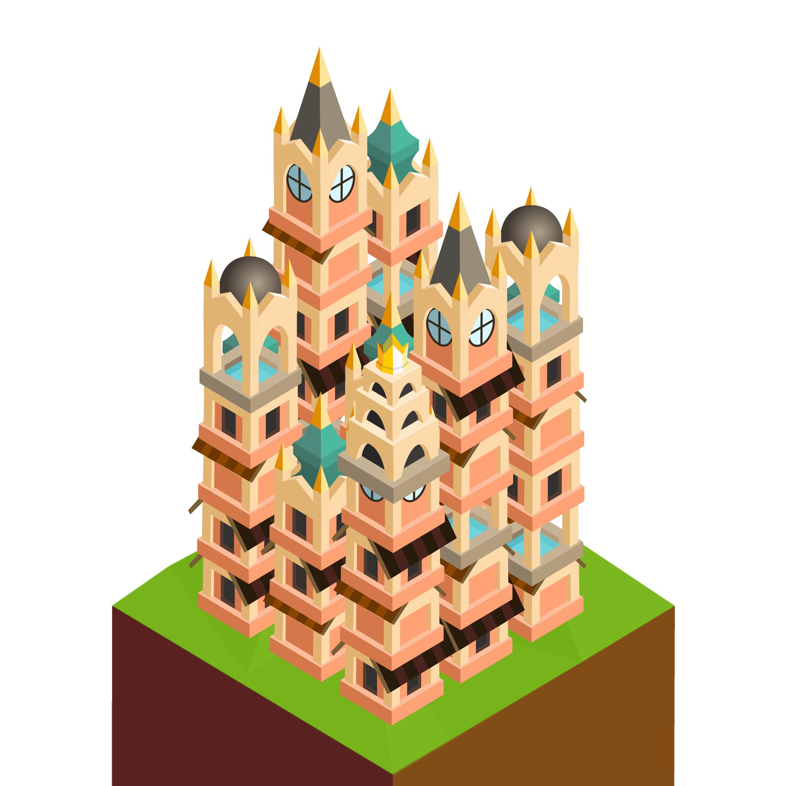

# The Tūrzu

*The Tūrzu are a tribe of wise, easy-going folk with a strong connection to the energies of their homeland, their ancestors appeased and befriended the spirits that control the geothermal energies beneath them.*

---

The Tūrzu start with the unique 'immolation' tech, and can give their troops blessings to boost their combat abilities.

## Techs

Imolation replaces Free Spirit

- allows building the Plains Temple instead of normal Temples
- unlocks the Immolate action instead of Disband
- unlocks the Blessing action

Chivalry

- also unlocks the Eruption action

Rejuvenation replaces Meditation

- allows building Bathhouses
- unlocks the Ignite task instead of Pacifist

Vulcanology replaces Philosophy

- allows training the Guru instead of Mind Bender

## Units

| replaces | name | cost | health | attack | defence | range | movement | skills |
|:---------|:-----|:----:|:------:|:------:|:-------:|:-----:|:--------:|:-------|
| Mind Bender | Guru | 5 | 15 | 2.5 | 1 | 2 | 1 | Dash, Burning Heart, Ignite, Auto-immolate |
| Giant | Hearth Champion | N/A | 40 | 4 | 1 | 1 | 1 | Hearth, Burning Heart, Auto-immolate |
| - | Hearth Spirit | 5 | 25 | 3 | 3 | 1 | 2 | Dash, Burning Heart, Fortify, Auto-immolate |

All veterans have the Burning Heart and Auto-immolate skills.
## Skills

Burning Heart

- heal 1 hp to every unit around this unit whenever the unit heals itself

Auto-immolate

- immolate automatically upon death. 

Ignite

- give an allied unit an opportunity to immolate even if they have already moved that turn

Hearth

- target and heal a single unit for 8 hp
- can be used after moving even though they do not have the dash skill

## Unit Actions

Immolate

- when a unit immolates they have an opportunity to deal damage to a single unit
- damage dealt is equal to damage at max health multiplied by flame bonuses
- they are destroyed immediately afterwards
- if a unit immolates but takes no action afterwards they disband next turn and return stars like normal
- they do not return any stars if they act on the turn they immolate

Blessing

- for 2 stars you can bring a unit 1 step closer to becoming a veteran
- may only be done once per unit
- for 5 stars, you can upgrade a veteran to a Hearth Spirit

## Tile Actions

Eruption

- costs 5 stars
- can only be done on mountains
- causes mountain to erupt, turning all forests and empty fields around the mountain into farmland

## Buildings

Bathhouse

- costs 5 stars to build
- must be built next to a mountain
- you can have no more than one bathhouse in every city
- provides 2 population
- heals 2 hp to every unit within a 3x3 area
- whenever a unit gets healed or promoted during your turn, every bathhouse will level up
- at the end of your turn every bathhouse produces stars equal to their level divided by 4
- bathhouses reset to level 0 at the start of your turn

## Tiles

### The Four Flames

If the Tūrzu appear in a game 4 flames will spawn on random tiles on the map, but they will each be within their own quadrant of that map so they won’t spawn close to each other. There will be one flame for each terrain type, one on a mountain, one on a field, one in a forest, and one in the ocean. The Tūrzu can capture them, and once captured they will each increase the attack power of immolation by +0.20x and produce 1 star per turn (maximum of 12) for every bathhouse you have built. 

For further clarification: without any flames immolation will deal the same damage a troop would normally deal at max health, but with each flame it increases as so:

1 flame: 1.2x damage  
2 flames: 1.4x damage  
3 flames: 1.6x damage  
4 flames: 1.8x damage

## Tasks

Ignite

- replaces the pacifist task
- to complete it you must find and capture all 4 flames

## Spawn Rates

Increased forests, fruit and metal. Force spawns a mountain next to every village in their territory if the map generation doesn't provide one.

## Images

