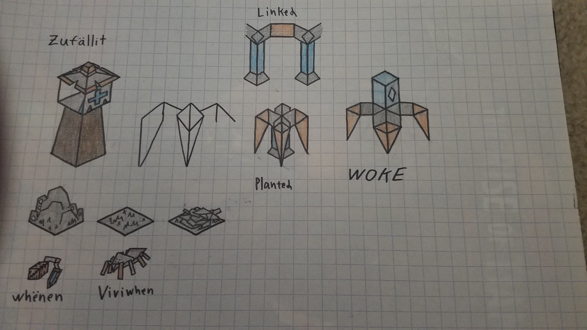
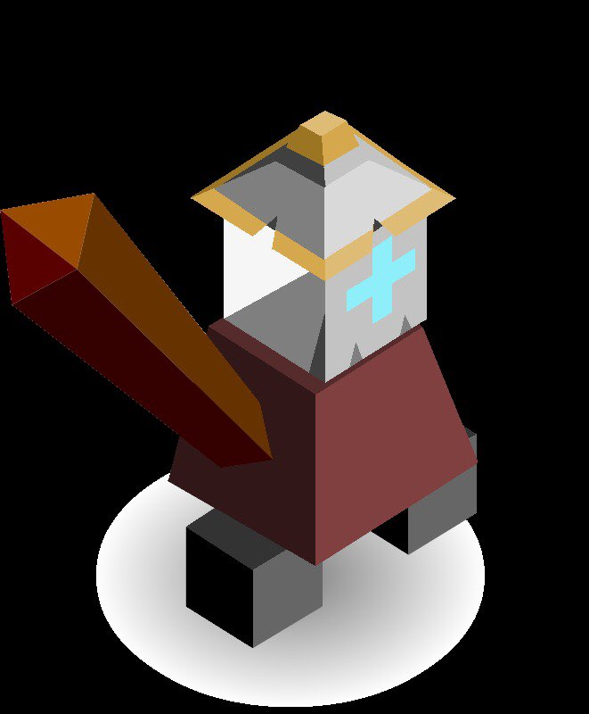
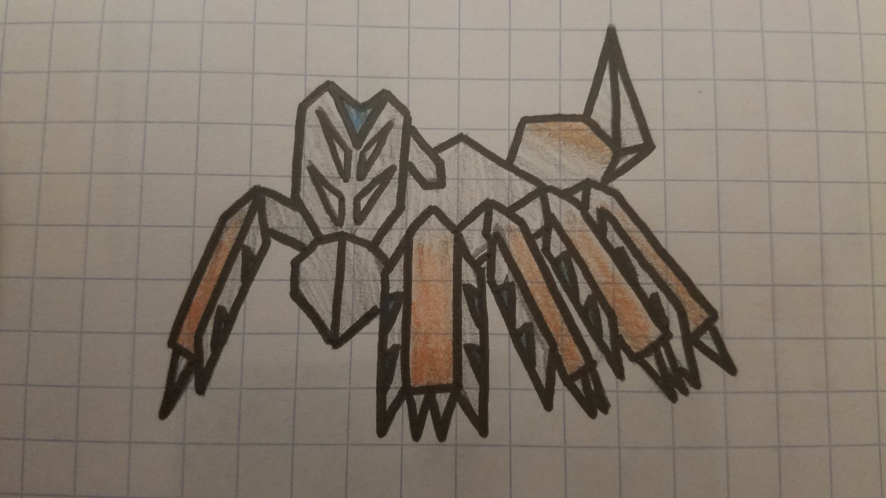

# The Zufällilt

*The Zufällilt emerge from their hibernation. They emerge in a desolate and forsaken place. Their cities now forsaken, have become mountains of ash and dust. After witnessing the chaos of the Square they decide to unify it through Zrëad.*

---

The Zufällilt start the game with the Zrëad tech and a Zîne unit.

## Techs

Zrëad replaces Philosophy

- allows training the Zîne unit
- literacy bonus

## Units

| name    | health | attack | defence | range | movement | skills  |
|:--------|:------:|:------:|:-------:|:-----:|:--------:|:--------|
| Zîne    | 2      | 2      | 2       | 1     | 0 (1)    | Vine    |
| Žanžźer | 20     | 0      | 2.5     | 1     | 3        | Webbing |

The Zîne is a self replicating vine type machine. It can uproot itself and move.

When the Zufällilt emerged from their hibernation they beheld that the mighty Viviwhen had survived their ancient battle. With some dusting off of their old tech they were able to attach some armor to a Viviwhen. This ancient armor grew the Viviwhen to incredible dimensions. This fearsome creature was then called the Žanžźer (super unit).

## Skills

### Vine

To uproot and move then costs 1 turn. Then to dig in costs another. Once dug it you use 2 stars and it replicates itself within one square of the dug in Zîne. If there is a connection between two cities the Zîne begins to auto-grow. And produce one extra Zîne per turn. All replicated Zîne are by default dug in. Then you pay another two starts to replicate a new one. If you don’t wish to use them to replicate then you can attack with them. All Zîne only have one use per turn. They attack like a warrior but only have 2 health. They can be mind-bended and turned against itself. The Zîne acts as a terrain as well. It speeds up the Zufällilt but restricts the movement of enemy troops.  
The vine act as a troop but, they speed up the troops that are in cities that will move. But they don’t affect the speed of units outside of cities. And if a troop and a vine are in the same place the vine will be destroyed.

### Webbing

Can strengthen Zînes around it or stick an enemy unit in place. Units around the stuck unit can cut the stuck unit free. Can create webs in adjacent tiles.

## City name syllables

Źa Üs Ne Fäll Zë Li No Ta Zerr Zu Mon Ëy

## Images

*Zînes and terrain*

*The Žanžźer*

*The Viviwhen*
